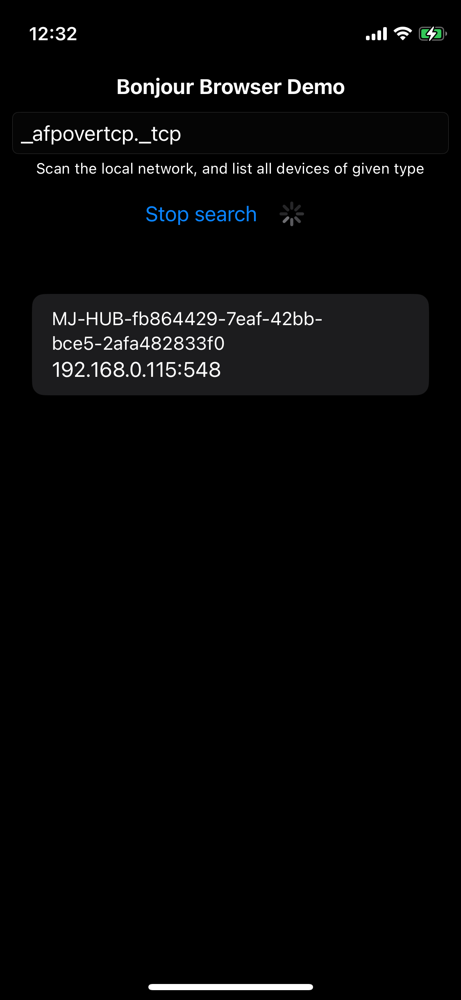

# Bonjour Demo

## Overview
The workspace contains two projects: a simple connection listener (BonjourServer) and a simple service browser (BonjourClient) that resolves Bonjour services and their IP addresses.
In the next sections you will find the tutorial for configuring Avahi daemon for Raspberry Pi.

## Installing ZeroConfig implementation (Avahi) on Raspberry Pi

Check Avahi status after connecting to the Internet:

`sudo systemctl status avahi-daemon`

If Avahi-daemon is already installed proceed to the next section, otherwise let's install it.

You will need an Internet connection to proceed, so use any tutorial to setup it.

Run

`sudo apt-get update`.

Then run

`sudo apt-get install avahi-daemon`.

Next, make sure it runs at startup.

## Configuring Avahi

Create a configuration file containing information about the server.

`sudo nano /etc/avahi/services/demoapp.service`

Enter (or copy/paste) the following:
```
<?xml version="1.0" standalone='no'?><!--*-nxml-*-->
  <!DOCTYPE service-group SYSTEM "avahi-service.dtd">
  <service-group>
      <name replace-wildcards="yes">%h</name>
      <service>
          <type>_demoapp._tcp</type>
          <port>12345</port>
      </service>
  </service-group>
```

Press `Ctrl+x` to exit, then press `y` to to save changes and return after confirming the location.
Then restart Avahi with command:

`sudo systemctl restart avahi-daemon`

### Useful resources

- [Setup Internet connection tutorial](https://raspberrytips.com/raspberry-pi-wifi-setup/)
- You can download `demoapp.service` (sample config file) from GitHub using command:
`wget https://raw.githubusercontent.com/mathsatan/bonjour-demo-app/main/demo.xml -O /etc/avahi/services/demoapp.service`

### Demo Screenshot (Client has found and resolved Bonjour service)


